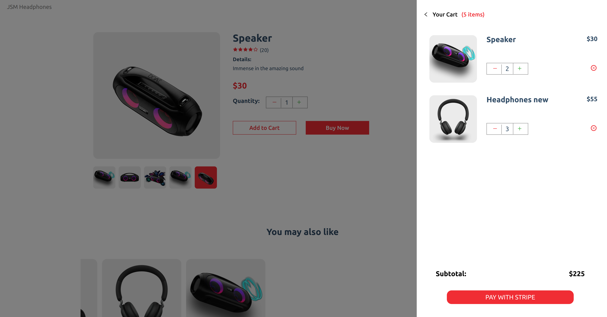
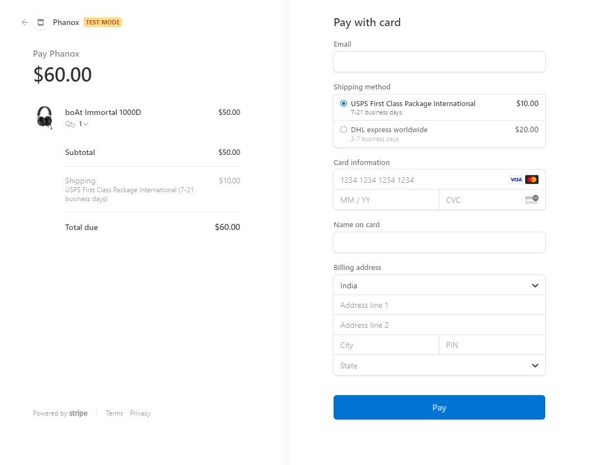

Modern Full Stack ECommerce Application with Stripe & Sanity
[Demo](https://rpmm-ecommerce-4um2eiz9e-ronnyp07.vercel.app/)


**Build and Deploy a fully responsive Modern Full Stack Ecommerce application with Payments functionality**. With Modern design, animations, the ability to add and edit products on the go using a CMS, all advanced cart functionalities, and the complete integration with Stripe so that you can cover REAL payments.

## Thecnology I used:
- Reactjs
    - Folder and file structure, hooks and refs
    - Advanced State Management of the entire application using React Context API
- Nextjs
    - File-based routing, Data fetching (show getServerSideProps, getStaticPaths, getStaticProps),
- Sanity
    - File storage, and databases
- Stripe
    - Integrate Stripe to manage payments, products, shipping rates, and the entire checkout process

## Getting Started

First, run the development server:

```bash
npm run dev
# or
yarn dev
```

Open [http://localhost:3000](http://localhost:3000) with your browser to see the result.






